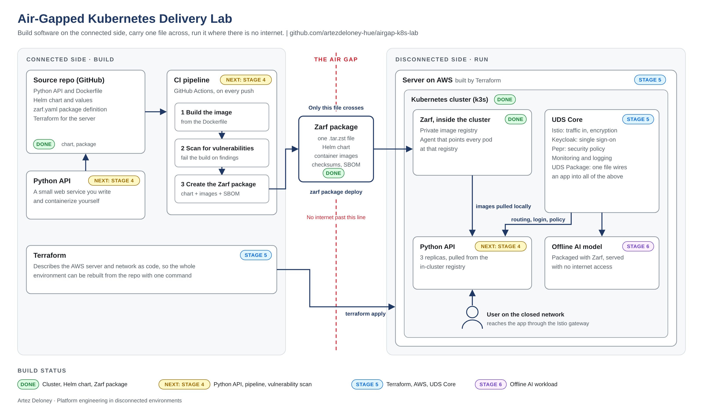

# Air-Gapped Kubernetes Delivery Lab

A hands-on lab that takes an application from source to a running deployment on Kubernetes **without the cluster pulling anything from the internet**. It uses [Zarf](https://zarf.dev) to package a Helm chart and its container images into a single file, then deploys from that file through a registry running inside the cluster.

This mirrors how software is delivered to disconnected and classified networks: build on the connected side, carry one artifact across, deploy on the far side.

## Target architecture



The diagram shows the finished design. Stages marked DONE are in this repo today; the rest are on the roadmap below.

## What is in this repo

| Path | Purpose |
|---|---|
| `app/` | The application: a small Python API (FastAPI) with `/health` and `/info`, and its Dockerfile |
| `charts/airgap-api/` | Helm chart for the application |
| `charts/airgap-api/values-lab.yaml` | Environment-specific settings: image, port, replica count, health probes |
| `zarf.yaml` | Zarf package definition: which chart and which images to bundle |

Built packages (`*.tar.zst`) are not committed. They are rebuilt from source.

## How it fits together

```
macOS (Apple Silicon)
└── Colima            Linux VM providing the container runtime
    └── k3d           runs k3s Kubernetes nodes as containers
        ├── 1 control plane node
        ├── 2 worker nodes
        ├── zarf namespace      in-cluster registry + admission agent
        └── airgap-api namespace   the application, 3 replicas behind a Service
```

`zarf init` installs a registry in the cluster and an agent that rewrites every pod's image reference to that registry. A pod that asks for `airgap-api:0.1.0` actually runs that image from `127.0.0.1:31999`, the in-cluster registry.

## Reproduce it

Requirements: `colima`, `docker`, `k3d`, `kubectl`, `helm`, `zarf`.

```bash
# 1. Runtime and cluster
colima start --cpu 4 --memory 4
k3d cluster create lab --servers 1 --agents 2

# 2. Prepare the cluster for air-gapped delivery
zarf tools download-init
zarf init --confirm

# 3. Build the application image
docker build -t airgap-api:0.1.0 app/

# 4. Build the package (the last step that needs internet)
#    The image is taken from the local Docker engine; with Colima, point Zarf at its socket.
export DOCKER_HOST="unix://$HOME/.colima/default/docker.sock"
zarf package create . --confirm

# 5. Deploy from the package file
zarf package deploy zarf-package-airgap-api-arm64-0.2.0.tar.zst --confirm

# 6. Verify the image came from the in-cluster registry
kubectl get pods -n airgap-api -o jsonpath='{.items[0].spec.containers[0].image}{"\n"}'

# 7. Call the API through its Service from inside the cluster
kubectl exec -n airgap-api deploy/airgap-api -- python -c "import urllib.request as u; [print(u.urlopen('http://airgap-api:8080/info').read().decode()) for _ in range(6)]"
```

Step 7 returns a different pod name across requests, showing the Service spreading traffic over the replicas.

## Changing the deployment

The repo is the source of truth. To change anything, such as the replica count:

1. Edit `charts/airgap-api/values-lab.yaml`.
2. Bump `metadata.version` in `zarf.yaml`.
3. Rebuild with `zarf package create`.
4. Deploy the new package.
5. Commit and push.

A package is a snapshot taken at build time. Edits made after the build are not in it until it is rebuilt.

## Lesson learned: a manual change that broke an upgrade

While testing, I scaled the deployment by hand with `kubectl scale`. The next package upgrade failed:

```
Apply failed with 1 conflict: conflict with "kubectl" with subresource "scale"
using apps/v1: .spec.replicas
```

**Cause.** Kubernetes server-side apply records a field manager for every field. The manual scale made `kubectl` an owner of `.spec.replicas`. When the package tried to set a different value, the API server refused the apply instead of letting one tool silently overwrite another.

**Diagnosis.** Listing the owners on the object showed the conflict:

```bash
kubectl get deployment <name> -n <namespace> --show-managed-fields -o yaml
```

**Fix.** Removed the package so the ownership records were cleared, then deployed the new version from source.

**Takeaway.** On a cluster managed as code, a manual change does not just drift from the source. It can block the next delivery. Changes go through the repo.

## Roadmap

- [x] Multi-node Kubernetes cluster with k3d
- [x] Application deployed with a Helm chart and environment-specific values
- [x] Zarf package built and deployed through the in-cluster registry
- [x] Replace the sample app with a small Python API and its own container image
- [ ] CI pipeline that builds, scans the image for vulnerabilities, and creates the package
- [ ] Deploy on UDS Core
- [ ] Terraform-built AWS infrastructure for the cluster
